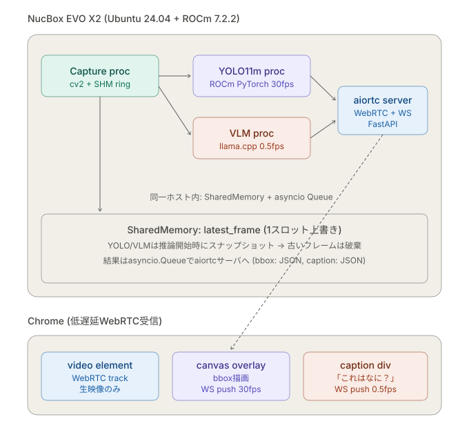
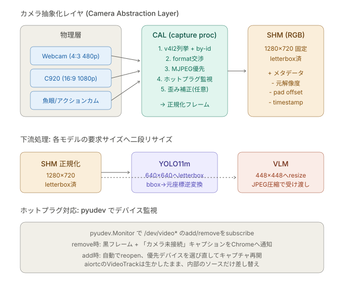

# Technical details

This document explains how the design from [`HANDOFF.md`](./HANDOFF.md) was implemented, why each design choice was made, and the gotchas discovered along the way. For setup instructions see [`README.md`](./README.md). 日本語版は [`TECHNICALJ.md`](./TECHNICALJ.md).

> **Note on transport**: the original design used WebRTC (aiortc) for video, but on a fully offline LAN (Wi-Fi off / no Internet) Chrome refuses to emit a single ICE host candidate and the connection wedges. We migrated to MJPEG (`multipart/x-mixed-replace`) over HTTP. See §5 and §7.4 for the full story.

---

## 1. System overview



A single NucBox EVO X2 (Ryzen AI MAX+ 395, gfx1151, 48 GB unified) runs four concurrent components and serves Chrome over MJPEG (`/stream.mjpg`) + WebSockets.

| Component | Process | Input | Output |
|---|---|---|---|
| Capture | `uv run capture-run` | USB camera | SHM (1280×720 BGR, letterboxed) |
| YOLO11m | A background thread inside `serve` | SHM | bbox JSON → `/ws/bbox` |
| VLM | `llama-server --reasoning off` (separate process) | HTTP requests (image + prompt) from `serve`'s VlmRunner | caption JSON → `/ws/caption` |
| MJPEG server | `uv run serve` (FastAPI + uvicorn) | SHM | `/stream.mjpg` (multipart/x-mixed-replace) + WS broadcast |

**Key design decisions**

- **SHM holds exactly one "latest frame slot"**. Capture overwrites continuously; consumers (MJPEG / yolo / vlm) snapshot (`np.array(copy=True)`) at the moment they begin processing. This structurally prevents stale-frame inference backlogs.
- **Frames never travel in queues**. Only bbox / caption JSON flow via asyncio.Queue → WebSocket.
- **VLM input is JPEG-encoded bytes**. We `cv2.imencode('.jpg', ...)` the raw SHM BGR and base64-post to llama-server's `/v1/chat/completions`.
- **YOLO runs as a thread inside the `serve` process**. The original handoff suggested a separate process, but torch/CUDA releases the GIL inside its C++ kernels, so the asyncio event loop is not blocked. Step 5 measured 8 ms p50 inference at fp16 — the choice is sound.
- **VLM is the only separate process (llama-server)** because (a) we want the 21 GB GGUF resident independently of the Python venv, and (b) it lets us tune / restart llama.cpp without disturbing the main server.

---

## 2. Camera abstraction layer (CAL)



`src/capture/` collects everything from the physical layer to normalized-frame output, satisfying the requirement "must keep working when the FOV or USB port changes."

### 2.1 Device discovery (`device_manager.py`)

- `pyudev.Context().list_devices(subsystem='video4linux')` enumerates v4l devices known to udev
- USB `ID_VENDOR_ID` / `ID_MODEL_ID` are read so specs like `vid_pid="046d:0892"` work
- The stable `/dev/v4l/by-id/...` symlink (when present) becomes `by_id`
- A single USB camera often exposes multiple v4l nodes (`index0` for video, `index1` for metadata, etc.); `is_capture_capable()` filters to nodes where `cv2.VideoCapture.read()` actually succeeds
- `config.yaml`'s `camera.preferred[]` is an **ordered priority list** of cameras (each entry one camera via `by_id` glob or `vid_pid`). `select_device_ranked()` returns the highest-priority capture-capable match plus its rank (the `preferred` index; `None` = matched only via `fallback`). `fallback: any` accepts an unlisted camera; `fallback: none` requires a `preferred` match. So with several listed cameras connected, only the top-ranked one is shown

### 2.2 Format negotiation (`format_negotiator.py`)

We try the `cv2.VideoCapture.set(CAP_PROP_FOURCC, ...)` ladder in `MJPG → YUYV` priority and read back `get(CAP_PROP_*)` to see what the driver actually accepted. MJPEG is preferred because YUYV blows the USB 2.0 budget at 1280×720@30fps.

### 2.3 Two-stage letterbox (`frame_normalizer.py`)

- **CAL output is fixed at 1280×720 BGR letterbox**
- Scale = `min(target_w/src_w, target_h/src_h)`, aspect preserved on shrink, padded with `(114, 114, 114)` gray
- `pad_x / pad_y / scale / original_w / original_h` are written into the SHM header so consumers can do the inverse mapping
- **YOLO11m (640×640) and VLM (~448×448) handle the second-stage resize themselves** (Ultralytics auto-letterboxes, mtmd resizes from JPEG). CAL doesn't do a second pass — it would just duplicate work
- Bbox coordinates are absolute in the CAL-normalized frame and broadcast as-is. The Chrome `<canvas width=1280 height=720>` natural resolution is stretched by CSS to match the video — only one scale factor on the browser side

### 2.4 Hot-plug support (`hotplug_watcher.py`, `capture_session.py`)

- `pyudev.MonitorObserver(filter_by='video4linux')` puts `add` / `remove` events on a queue
- The main loop is a **two-state machine**:
  - `SEARCHING`: no working capture. Writes a black frame + `connected=False` to SHM at 30 fps so consumers immediately see "no camera"
  - `CAPTURING`: a separate `CaptureReader` daemon thread runs `cv2.VideoCapture.read()`; the main thread writes to SHM
- `CaptureReader` exists because `cv2.VideoCapture.read()` can block when the device is yanked; the daemon thread reads continuously, and `cap.release()` on stop unsticks the read
- A `remove` event for the active dev_path transitions to SEARCHING, which rescans and reconnects to any remaining listed camera
- An `add` event in SEARCHING triggers an immediate rescan. An `add` in CAPTURING arms a `preempt_settle_sec` debounce timer (udev fires before the device is ready); when it expires, the loop re-evaluates excluding the active dev_path and, **only if a strictly higher-priority camera appeared**, opens it first and then swaps the `CaptureReader` (so no black frame is inserted). A lower- or equal-priority `add` is ignored — that is what keeps "show only one when several are plugged." Set `preempt: false` to disable live switching
- The MJPEG stream reads through the SHM, so swapping cameras does not break the `` connection (the HTTP stream stays alive, with black frames bridging the gap until the live feed returns)

### 2.5 Adding a camera

Enabling a new USB camera is just one entry in `config.yaml`'s `camera.preferred[]` — no code changes.

1. **Find its identifier** — plug the camera in and run `uv run list-cameras`. Rows with `CAPTURE = yes` are the nodes that can deliver frames (one camera exposes several nodes: `index0` for video, `index1` for metadata, etc.). Note that row's `BY-ID` (= `by_id`) or `VID:PID` (= `vid_pid`).

   ```
   CAPTURE  DEV            VID:PID     BY-ID
   yes      /dev/video0    056e:701a   usb-Alcor_Micro__Corp._ELECOM_2MP_Webcam-video-index0
   no       /dev/video1    056e:701a   usb-Alcor_Micro__Corp._ELECOM_2MP_Webcam-video-index1
   ```

2. **Pick the identifier** — use `by_id` when you need to distinguish individual units of the same model (unique if the `BY-ID` carries a serial; the trailing part can be a `*` glob), or `vid_pid` for a quick model-level match (compared lowercased, exact). Write **only one** of them per entry.

3. **Append it to `camera.preferred[]`** — the list is **highest priority first**. With several listed cameras connected, only the top-ranked match is shown. Put it first to make it the top choice, or last for fallback treatment (used only when nothing higher matches). `name` is a free-form label for logs and is not used by the selection logic.

   ```yaml
   camera:
     preferred:
       - name: 2k-usb-camera          # rank 0 (top priority)
         by_id: usb-DC474C08_..._2K_USB_Camera_...*
       - name: elecom-2mp             # last = fallback treatment
         by_id: usb-Alcor_Micro__Corp._ELECOM_2MP_Webcam-video-index0
   ```

4. **Apply it** — restart capture to reload the edited `config.yaml` (`./stop_all.sh && ./start_all.sh`). With `preempt: true`, hot-plugging a higher-priority camera while running also switches over automatically, but the config edit itself takes effect on restart.

> With `fallback: any` (the default), a camera not listed in `preferred` still connects at the lowest priority. Set `fallback: none` to use **only** the cameras listed in `preferred`.

---

## 3. SharedMemory design (`shm_writer.py`)

### 3.1 Layout (36 B header + frame data)

| offset | size | field |
|--------|------|-------|
| 0 | 8 | `seq_lock` (uint64): even=stable / odd=writer mid-write |
| 8 | 8 | `timestamp_ns` (uint64) |
| 16 | 2 | `original_w` (uint16) |
| 18 | 2 | `original_h` (uint16) |
| 20 | 2 | `frame_w` (uint16) |
| 22 | 2 | `frame_h` (uint16) |
| 24 | 2 | `pad_x` (uint16) |
| 26 | 2 | `pad_y` (uint16) |
| 28 | 4 | `scale` (float32) |
| 32 | 1 | `channels` (uint8) |
| 33 | 1 | `pixel_format` (uint8): 0=BGR / 1=RGB |
| 34 | 1 | `connected` (uint8): 0=synthetic black / 1=live |
| 35 | 1 | (padding) |
| 36 | W·H·3 | frame data (uint8) |

`struct` format: `<QQHHHHHHfBBB1x` (36 B confirmed via `struct.calcsize`).

### 3.2 Seqlock semantics

There is exactly one writer (Capture). On x86_64, aligned 8-byte writes are hardware-atomic, so a lock-free seqlock works:

```
Writer:
    1. seq = next odd      (= "writing" marker)
    2. write header + frame
    3. seq = next even     (= "stable" marker)

Reader:
    for retry in range(16):
        s1 = read seq
        if s1 odd: sleep(100us); continue   ← writer in flight
        copy header + frame
        s2 = read seq
        if s1 == s2: success
        else: continue                       ← writer overwrote during my copy
    return None                              ← couldn't catch a stable read in 16 tries
```

### 3.3 Fixing the "occasional black flash"

In the first version, the reader did 8 tight retries → returned `None` → the downstream consumer (then `ShmVideoTrack`, now the MJPEG generator) fell back to a black frame, producing a 1-frame black flash on Chrome. The cause:

- The writer's "odd" residency is ≈ 500 µs (`np.copyto` over 2.6 MB)
- The reader's tight 8-retry loop only spent ~8 µs total, giving up before the writer was done

Fix:

1. Insert `time.sleep(100us)` between retries in `read()`, raise the cap from 8 → 16
2. Cache "last successful frame" downstream; on `None`, reuse the cache (with a 1-second TTL guard to detect a writer that died) — first added in `ShmVideoTrack`, mirrored in the current MJPEG generator

After this, observed black-flash frequency is zero in normal use.

### 3.4 resource_tracker patch

`multiprocessing.shared_memory` has [bpo-38119](https://bugs.python.org/issue38119): even attaching processes try to `unlink` on exit, producing spurious warnings and double-unlinks. `_suppress_resource_tracker_for_shm()` monkey-patches `register` / `unregister` to ignore `shared_memory` — the standard workaround.

---

## 4. Inference backends

### 4.1 YOLO11m (Step 3)

| Item | Value |
|------|----|
| Backend | Ultralytics + ROCm PyTorch 2.9.1 |
| Input | 1280×720 BGR (SHM normalized frame) |
| `imgsz` | 640 (Ultralytics letterboxes internally; bboxes return in input-frame coords) |
| Quantization | fp16 (`yolo.half: true`) |
| Standalone fps | **97.8 fps** (`benchmark-yolo --source shm`, no dedup, GPU-bound) |
| Pipeline fps | **30.1 fps** (`benchmark-concurrent --no-vlm`, capped at the camera FPS) |

**Beware the baseline confusion**: `benchmark-yolo --source shm` re-reads the same SHM frame multiple times and measures pure GPU throughput (97.8 fps). `benchmark-concurrent --no-vlm` deduplicates on `meta.seq` and pins itself to the camera rate (30 fps). Step 5 must be compared against the latter; otherwise you'd misread the result as "-71% degradation."

Fallback plan (`scripts/export_yolo_onnx.py`): `model.export(format='onnx', imgsz=640, simplify=True)` writes an ONNX runnable by `onnxruntime`. CPU EP measured **15.4 fps** (insufficient as primary; this only buys graceful degradation). The MIGraphX EP requires an AMD-built ort.

### 4.2 Nemotron-3 Nano Omni (Steps 4 / 7b)

| Item | Value |
|------|----|
| Model | `unsloth/NVIDIA-Nemotron-3-Nano-Omni-30B-A3B-Reasoning-GGUF`, Q4_K_XL (~21 GB) + mmproj-F16 (~1.5 GB) |
| Runtime | llama.cpp ROCm/HIP build (`llama-server` resident) |
| Input | 1280×720 BGR → JPEG (quality 90) → base64 → `/v1/chat/completions` |
| `n_predict` | 128 (~50 Japanese chars ≈ 60–100 tokens) |
| Standalone inference | **~1262 ms** (Step 4 mtmd-cli) / **~1300 ms** (Step 7b llama-server) |
| Concurrent inference | **~1294 ms** (Step 5, with YOLO running) — only +2.5% degradation |

**`--reasoning off` is mandatory.** Because this is a Reasoning model, the default (`auto`) lets `<think>` tags consume the entire `n_predict` budget, leaving the visible answer empty. Notably, the same GGUF behaves differently under `mtmd-cli` (which produces an empty `<think></think>` block) — this divergence between runtimes was a real source of confusion.

`VlmServerWorker` parses the llama-server `/v1/chat/completions` response by:

- Reading caption text from `choices[0].message.content`
- Stripping `<think>...</think>` defensively with a non-greedy regex
- Filling `VlmTiming` from `timings.prompt_ms / predicted_ms / *_per_second` and `usage.prompt_tokens / completion_tokens`

### 4.3 Step 5: YOLO + VLM concurrent Go/No-Go

```
                          YOLO alone   YOLO+VLM (fp32)   YOLO+VLM (fp16)
fps                       30.1         27.9              27.9
p50 latency (ms)          11.07        11.78             8.05
p99 latency (ms)          11.80        88.67             112.32
VLM median inf (ms)       —            1294              1151
VLM eval_tps              —            48.1              53.6
```

Output of `benchmark-concurrent --frames 600`. The notable finding: **fp16 widens the VLM's window**, not the YOLO fps (fps is camera-capped at 30). YOLO finishing per frame in 8 ms instead of 11 ms gives VLM bigger uninterrupted GPU windows. The p99 spikes (~100 ms) come from VLM's eval phase contending for the GPU; visually this is roughly 3 frames of bbox stutter every 2 s.

---

## 5. Video delivery (`src/server/`)

### 5.1 Why we dropped WebRTC

The original implementation used aiortc + `RTCPeerConnection` to serve a WebRTC video track. On the same LAN we assumed host candidates alone would be enough, no STUN/TURN required. Once the demo ran on an offline LAN (Wi-Fi off, no Internet), we hit a dead end:

- `POST /offer` returned 200
- aiortc transitioned to `connection state -> connecting`
- …and never advanced — neither `connected` nor `failed`. The browser stayed black

`chrome://webrtc-internals` showed that Chrome's `onicecandidate` **never fired**, and `iceState` remained `new`. Without a non-loopback interface, Chrome's WebRTC stack stops emitting any local host candidates at all. Things we tried and the outcomes:

1. **Monkey-patch aioice's loopback filter** so the server publishes `127.0.0.1` as a host candidate → the server side now offered a usable candidate, but the browser still produced none, so no pair could form
2. **Switch the page URL between `http://localhost:8080/` and `http://127.0.0.1:8080/`** → no change
3. **Disable `chrome://flags/#enable-webrtc-hide-local-ips-with-mdns`** → no change
4. **Pass an unreachable dummy STUN to `RTCPeerConnection({iceServers: [{urls: 'stun:127.0.0.1:3478'}]})`** → no change
5. **Implement trickle ICE** (server `POST /candidate` + client `icecandidate` posting) → Chrome doesn't fire the event in the first place, so trickle has nothing to send

Since we couldn't change Chrome's behavior, we switched to a transport that doesn't need ICE at all.

### 5.2 MJPEG stream (`app.py`)

`GET /stream.mjpg` returns a `StreamingResponse` with `multipart/x-mixed-replace; boundary=frame`:

```python
@app.get("/stream.mjpg")
async def stream_mjpg() -> StreamingResponse:
    async def gen():
        shm: FrameSHM | None = None
        last_seq = -1
        black = np.zeros((target_h, target_w, 3), dtype=np.uint8)
        while True:
            t_start = time.monotonic()
            if shm is None:                              # lazy attach
                try: shm = FrameSHM.attach(shm_name)
                except (FileNotFoundError, RuntimeError): pass
            frame = black
            if shm is not None and (got := shm.read()) is not None:
                fresh, meta = got
                if meta.seq != last_seq:
                    frame = fresh; last_seq = meta.seq
                else:
                    frame = fresh
            ok, jpeg = await asyncio.to_thread(
                cv2.imencode, ".jpg", frame, [cv2.IMWRITE_JPEG_QUALITY, jpeg_quality])
            if ok:
                yield (f"--frame\r\nContent-Type: image/jpeg\r\n"
                       f"Content-Length: {len(jpeg)}\r\n\r\n").encode() + jpeg.tobytes() + b"\r\n"
            await asyncio.sleep(max(0.0, frame_period - (time.monotonic() - t_start)))
    return StreamingResponse(gen(), media_type="multipart/x-mixed-replace; boundary=frame", ...)
```

Highlights:

- **Lazy attach** — capture-run can start after the server; until SHM exists we emit `black` to keep the HTTP stream alive
- **JPEG encoding off-thread** — `cv2.imencode` is CPU-heavy, so we hand it to `asyncio.to_thread` (Python 3.9+) to keep the event loop responsive
- **Rate limit** — `config.yaml > camera.format.fps` (= 30) becomes `frame_period`, enforced via `asyncio.sleep`
- **Quality** — `config.yaml > server.mjpeg_quality` (default 80). At 1280×720 a single frame is ~80–120 KB, i.e. ~20–30 Mbps at 30 fps
- **No ICE / STUN / TURN** — plain HTTP, so the LAN and offline cases behave the same way

### 5.3 WS broadcast (`ws_broadcaster.py`, `yolo_runner.py`, `vlm_runner.py`)

The WebRTC → MJPEG migration left these untouched:

- `WsBroadcaster`: client set + asyncio Lock + JSON broadcast. Drops clients that fail to send
- `YoloRunner`: daemon thread. SHM read → predict → updates a thread-safe `_latest = {...}` slot
- `_broadcast_bbox_loop`: a 30 fps async task that dedups on `frame_seq` and pushes to `/ws/bbox`
- `VlmRunner`: same pattern with cadence 2 s. Health-checks llama-server → SHM attach → loop. Dedups on `ts_ns`
- `_broadcast_caption_loop`: 0.5 fps cadence

### 5.4 Frontend (`src/web/`)

- A 3-layer stack: `` (MJPEG), `<canvas>` (bbox), semi-transparent `<div>` (caption)
- `<canvas>` has fixed `width=1280 height=720` and is positioned absolutely over the ``. Bbox coords are CAL-normalized, so a single CSS scaling step is all the browser needs
- `` sets the status row to `streaming` on `load`; on `error` it reconnects with exponential backoff (capped at 5 s) and a `?t=<ts>` cache-buster on the `src`
- Both `overlay.js` and `caption.js` reconnect on WebSocket disconnect with exponential backoff (capped at 5 s)

### 5.5 What we left in the tree

`src/server/webrtc_track.py` is no longer imported but remains in the repo, in case a future deployment can provide a STUN/TURN server and we want to revisit WebRTC. `pyproject.toml`'s `[webrtc]` extra still installs `aiortc` for the same reason — the current `serve` simply doesn't import it.

---

## 6. Start / stop scripts

### `start_all.sh`

Three windows in tmux session `llava`:

1. `capture` ← `uv run capture-run`
2. `serve` ← `uv run serve` (FastAPI + YoloRunner + VlmRunner)
3. `vlm` ← `~/llama.cpp/build/bin/llama-server ... --reasoning off`

ROCm env vars (`ROCM_PATH`, `HIP_VISIBLE_DEVICES`) are exported per pane, so even a missing `~/.bashrc` setup doesn't break the demo. `HSA_OVERRIDE_GFX_VERSION` is deliberately **`unset`** instead — see §9.4-5. After spawning, the script polls `http://localhost:8080/` with `curl` for up to 30 s before opening Chrome (or chromium / xdg-open as fallback).

### `stop_all.sh`

Sends `Ctrl-C` to each window → waits 5 s → `tmux kill-session`. Any survivor processes are caught via `pgrep -f "src.server.app|capture.main|llama-server"` and cleaned up with SIGINT → SIGKILL.

---

## 7. Gotchas discovered during implementation

### 7.1 Capture / SHM

- **Seqlock retries need a sleep.** A tight loop misses the writer's 500 µs window (§3.3)
- **`multiprocessing.shared_memory` resource_tracker patch.** Suppresses double-unlink warnings (§3.4)
- **`shm.read()` returns `(frame, meta)`, not `(ts, frame)`.** The first version of `benchmark_concurrent.py` wrote `ts, frame = got` and hit `ValueError: array truth value ambiguous`
- **`cv2.VideoCapture.read()` blocks when the USB device is yanked.** Read on a separate thread, time it out from the main thread (`CaptureReader`)

### 7.2 YOLO

- **Different baselines differ ~3×.** GPU-bound (97.8 fps) vs pipeline-bound (30.1 fps). Don't compare across them
- **fp16 helps the VLM, not the YOLO fps.** Standalone YOLO is camera-capped, but fp16 raises VLM eval_tps by +12% in the concurrent case

### 7.3 VLM (llama.cpp)

- **`llama-mtmd-cli` has no `--no-display-prompt` flag** — stdout echoes the prompt, so the Python client strips it post-hoc
- **stderr can contain non-UTF-8 bytes** (control chars from the model-load progress display). Use `subprocess.run(..., errors='replace')`
- **Naively regexing `prompt eval time` and `eval time` matches the same line twice.** A `(?<!prompt )eval time` negative lookbehind disambiguates
- **`llama-server`'s default `--reasoning auto` causes *-Reasoning models to burn `n_predict` on `<think>` tokens.** `--reasoning off` is required

### 7.4 Video transport / frontend

- **Chrome won't emit any ICE candidates when fully offline.** Wi-Fi off + only loopback → host candidate gathering is silently abandoned (`chrome://webrtc-internals` never fires `onicecandidate`, `iceState` stuck at `new`). Patching aioice's loopback exclusion or implementing trickle ICE does not help, because the browser itself produces nothing to pair against. We migrated to MJPEG specifically to dodge this — see §5.1
- **MJPEG bandwidth is ~20–30 Mbps per client.** At 1280×720 / 30 fps / JPEG quality 80 a frame is ~80–120 KB. Bandwidth and `cv2.imencode` CPU both scale linearly with the number of connected browsers
- **Chrome JS cache.** When `caption.js` or similar fails to refresh, hard-reload (Ctrl+Shift+R). For the MJPEG endpoint a `?t=<ts>` query is a reliable cache-bust
- **Sign convention in metric reports.** Showing "fps decreased" as `+71.5%` is misleading. Standardize on "+ = better, - = worse"

---

## 8. NPU backend for YOLO11m (XDNA2 / VitisAI EP)

Record of moving YOLO11m object detection from the legacy **Ultralytics YOLO (GPU/ROCm,
`yolo11m.pt`)** onto **NPU execution (VitisAI EP, `yolo11m_a16w8.onnx`)** (implementation and
on-device validation: Opus, 2026-07-07). The VLM (Nemotron), camera, and MJPEG delivery are
untouched. It is built as a sidecar; detection was reproduced on real NPU hardware, offload
was demonstrated with `xrt-smi`, and the HTTP wiring was integration-tested. See
[`README.md`](./README.md) for usage and operational notes.

### 8.1 As-built architecture

The same "separate process + local HTTP" pattern as the VLM (llama-server). NPU inference is
isolated in its own process (the sidecar); the serve process merely polls its HTTP.

```
[capture proc]          [npu-yolo sidecar proc]              [serve proc (uv venv)]
 USB cam                 RAI venv + VitisAI EP                FastAPI + MJPEG + WS
   |                       |  attach SHM(webcam_latest)          |
   |---> SHM ------------->|  read latest frame (when seq moved) |
                           |  preprocess: letterbox640/RGB/÷255  |
                           |  onnx(a16w8) inference @ NPU        |
                           |  decode + class-aware NMS           |
                           |  inverse letterbox → input coords   |
                           |  bbox JSON  --HTTP GET /latest------>|  poll(60Hz) → get_latest()
                           |  (http.server /latest, /health)     |  → push to /ws/bbox (unchanged)
```

**Why a separate process**: NPU execution needs the VitisAI EP's onnxruntime + XRT's
`LD_LIBRARY_PATH`, which only exist in the Ryzen AI venv (now `~/ryzenai_1_8/venv`, sourced via
`scripts/rai_env.sh` — see §9.5). Merging that with LLaVA's
own uv venv (torch-ROCm / ultralytics / fastapi) risks dependency conflicts and environment
pollution, so — like the VLM — we split it into its own process. The enabler is that
`FrameSHM` in `src/capture/shm_writer.py` is pure Python (only numpy +
`multiprocessing.shared_memory`, no torch), so it can be imported from the RAI venv to read SHM.

### 8.2 Files added / changed

| File | Kind | Contents |
|---|---|---|
| `src/npu_yolo/postprocess.py` | new | Pure numpy/cv2 pre/post-processing: `letterbox`, `preprocess`, **`decode_detections` with inverse letterbox + class-aware NMS**, `COCO_CLASSES`. torch-free, so importable from the RAI venv |
| `src/npu_yolo/__init__.py` | new | Empty. A standalone subpackage so it does not drag in `src/inference/__init__.py` (which imports the vlm/yolo workers) |
| `scripts/npu_yolo_sidecar.py` | new | **The NPU sidecar itself.** Runs under the RAI venv. Subscribes to SHM → VitisAI EP inference → decode → serves `/latest` and `/health` via the stdlib `http.server`. Inference on a daemon thread, HTTP on the main thread |
| `src/server/yolo_runner.py` | changed | Branches on `backend`. `npu` = poll the sidecar's `/latest` and re-broadcast; `gpu` = the legacy ultralytics thread. The external interface (`start`/`stop`/`ready`/`get_latest`) is unchanged, so **app.py needs no edits** |
| `config.yaml` | changed | Adds `yolo.backend: npu` and `yolo.npu:{onnx,sidecar_url,port,poll_hz}`. The gpu settings (`model`/`device`/`half`) are kept too |
| `start_all.sh` | changed | Reads `backend` from config and, only when `npu`, starts a 4th tmux window `npu-yolo` under the RAI venv, with existence checks for the model and RAI env. Windows 0/1/2 (capture/serve/vlm) are unchanged; npu-yolo is 3 |
| `stop_all.sh` | changed | Adds cleanup for the `npu-yolo` window and the `npu_yolo_sidecar` process |
| `tests/test_npu_postprocess.py` | new | Unit tests (6) for inverse letterbox, clipping, class-aware NMS, and thresholds |
| `.gitignore` | changed | Adds NPU compile caches such as `vaip_cache/` |
| `models/yolo11m_a16w8.onnx` | placed | Copied from `~/yolotest`. `*.onnx` is `.gitignore`d, i.e. not committed to the repo |

### 8.3 On-device verification results

| Check | Result |
|---|---|
| Unit tests (6 pre/post-processing) | ✅ 6/6 pass |
| Real NPU inference + decode (bus.jpg) | ✅ **4× person + 1× bus** (0.89/0.89/0.89/0.75, bus 0.87). ~34 ms/frame |
| Inverse-letterbox coordinates | ✅ All bboxes inbounds within the 810×1080 frame; correct in the input-frame coordinate system |
| NPU offload (`xrt-smi`) | ✅ **HW Context=Active, Columns[0-7], Submissions rising 5→64→123** |
| HTTP wiring (sidecar ⇄ YoloRunner) | ✅ Integration test confirmed `/latest` (200/503), `/health`, and `runner.get_latest()` agree |
| Syntax check | ✅ `compileall` and `bash -n` both OK |

The live end-to-end path (camera → SHM → sidecar → serve → browser) was confirmed on real
camera hardware after the 2026-07-24 environment recovery (`start_all.sh` brings up all 4
windows in one shot; `/latest` returns `person conf=0.73` etc. — see §9).

### 8.4 Design rationale (why this way)

#### 8.4.1 Assumptions already established by yolotest
| Fact | Detail |
|---|---|
| YOLO11m runs on the NPU | A16W8 quantization → VitisAI EP offloads every node, ~28 inf/s |
| **A16W8 is mandatory** | XINT8 (8-bit activations) collapses the classification head → **zero detections**. A16W8 (INT16 activations / INT8 weights) recovers FP32-equivalent accuracy |
| A quantized model already exists | `~/yolotest/yolo11m_a16w8.onnx` (usable as-is, no re-quantization needed) |
| A prototype for pre/post-processing exists | `~/yolotest/decode_detect.py` (letterbox640 + decode + NMS) |

Primary sources: `~/yolotest/READMEJ.md` (the working procedure), `~/yolotest/HANDOFF.md`
(failure cases and the xrt-smi pass criteria).

#### 8.4.2 Coordinate system (inverse letterbox) — the biggest implementation point
Ultralytics returned bboxes in the **input-frame coordinate system** for a 1280×720 input.
The NPU path does its own 640 letterbox, so using `decode_detect.py` (which displayed in raw
640 coordinates) as-is would misplace the boxes. `src/npu_yolo/postprocess.py` implements a
strict **inverse letterbox**: with `scale = min(640/h, 640/w)` and `left,top` as the padding,
`x_orig = (x_lb - left)/scale`, `y_orig = (y_lb - top)/scale`, then clip to the frame bounds.
This transform is pinned by unit tests. NMS is made **class-aware** to match the Ultralytics
default (boxes of different classes do not suppress each other).

#### 8.4.3 bbox JSON schema (kept unchanged for client compatibility)
The sidecar emits the same schema as `YoloRunner._publish`, and serve forwards it verbatim to `/ws/bbox`:
```python
{"frame_seq", "ts_ns", "frame_w", "frame_h", "connected",
 "boxes": [{"label", "conf", "x1", "y1", "x2", "y2"}, ...]}   # coords in the input-frame system
```
`frame_seq` carries the SHM seq as-is, so app.py's seq-based dedup keeps working as before.

### 8.5 Out of scope (not touched here)
- The VLM (Nemotron / llama-server) path — unchanged.
- Camera capture / SHM writer / MJPEG delivery / WebSocket wiring — unchanged (`FrameSHM` is only read from the sidecar).
- Accuracy tuning — A16W8 already yields FP32-equivalent results, so no extra quantization work.

---

## 9. NPU recovery after OS/ROCm upgrade (Ubuntu 26.04 / ROCm 7.14)

Right after upgrading Ubuntu to **26.04** and ROCm to **7.14**, the NPU (`amdxdna`) stopped
working (performed by: Opus 4.8, 2026-07-24). Several independent problems were isolated and
fixed until, at ordinary user privilege, `xrt-smi examine` recognizes the **NPU Strix Halo
(Firmware 1.1.2.65)**. For the operator-facing final-verification steps, see the "NPU
recovery / operations notes" section of [`README.md`](./README.md).

### 9.1 Symptoms before recovery
- `xrt-smi examine` → **0 devices found**
- `/dev/accel/` does not exist
- `lsmod | grep xdna` → empty (`amdxdna` not loaded)
- but recognized on PCI: `c6:00.1 ... Strix Halo Neural Processing Unit`

### 9.2 Root causes and fixes (3 independent NPU-device-side problems)

| # | Problem | Root cause | Fix |
|---|---------|------------|-----|
| 1 | `amdxdna` not loaded | Not auto-loaded after the kernel swap | Resolved by the DKMS rebuild (folded into #2) |
| 2 | `modprobe amdxdna` → `Exec format error` / `disagrees about version of symbol module_layout` | **The DKMS module was built against stale headers.** The running kernel is a gcc-15 build (`module_layout` CRC `0xe9196a28`), but the DKMS artifact demanded `0xd954c786`. During the Ubuntu 26.04 upgrade, the "running kernel image" and the "header state DKMS builds against" drifted apart | Rebuild DKMS against the current kernel |
| 3 | `xrt-smi examine` → `mmap(len=64MB, offset=4GB) failed (err=-11 EAGAIN)` | **The memlock limit was 8 MB (8192 KB)** — too low for the 64 MB of pinned memory XRT/NPU requests (confirmed by the fact that it succeeded under root, where memlock is looser) | Apply `memlock unlimited` to all users |

```bash
# --- Problems #1/#2: rebuild DKMS against the current kernel ---
sudo dkms remove  xrt-amdxdna/2.21.260102.53.release --all
sudo dkms install xrt-amdxdna/2.21.260102.53.release
sudo depmod -a

# Pre-check: does the required CRC match the running kernel? (note it's a .ko.zst)
modprobe --dump-modversions /lib/modules/$(uname -r)/updates/dkms/amdxdna.ko.zst | grep module_layout
#  → 0xe9196a28  module_layout  (matching the kernel image = likely to succeed)

sudo modprobe amdxdna
ls -l /dev/accel/          # → accel0 gets created

# --- Problem #3: memlock to unlimited (applied to PAM login sessions) ---
echo '* - memlock unlimited' | sudo tee /etc/security/limits.d/99-xrt-memlock.conf
# NB: takes effect after re-login. The current root session is already loose, so verify via sudo:
sudo bash -c 'source /opt/xilinx/xrt/setup.sh; xrt-smi examine'
```

Post-recovery confirmation:
```
XRT
  Version              : 2.21.75
  amdxdna Version      : 2.21.260102.53.release_20260309
  NPU Firmware Version : 1.1.2.65

Device(s) Present
  [0000:c6:00.1]  NPU Strix Halo   ✅

dmesg:
  amdxdna 0000:c6:00.1: PASID address mode enabled
  [drm] Initialized amdxdna_accel_driver 1.0.0 for 0000:c6:00.1 on minor 0
```
- Kernel: `7.0.0-28-generic` (gcc 15.2.0 build)
- `ulimit -l`: loose/succeeds under root; ordinary users get **unlimited after re-login**

### 9.3 Two environment problems surfaced at pipeline launch (`start_all.sh`)

After the NPU itself was recovered, the first `./start_all.sh` brought up 4 windows in which
**capture / vlm were fine** but **serve and npu-yolo failed to start for separate reasons** —
both side effects of the Ubuntu 26.04 upgrade.

| # | Window | Symptom | Root cause | Fix |
|---|--------|---------|------------|-----|
| A | serve | `ModuleNotFoundError: No module named 'fastapi'` | The upgrade **recreated `.venv` with base deps only**; fastapi etc. live in `[project.optional-dependencies].webrtc` and were not synced. `uv run serve` implicitly syncs the env down to base, so fastapi never lands | Launch with **`uv run --extra webrtc serve`** (fixed in `start_all.sh`) |
| B | npu-yolo | `ModuleNotFoundError: No module named 'encodings'` / `init_fs_encoding failed` (the interpreter itself won't boot) | The ryzenai venv was built **from the old `/usr/bin/python3.12` (3.12.3) with `--copies`**. Under 26.04 the system Python became **3.14**, so `/usr/bin/python3.12` and `/usr/lib/python3.12` (stdlib) disappeared → the copied python binary lost its stdlib and cannot boot | **In-place upgrade** the venv with the uv-managed standalone `cpython-3.12.13` (swap only the interpreter/stdlib references, keeping all 330 site-packages) |

Fix commands for problem B:
```bash
# Facts established by prior investigation:
#  - RAI 1.7.1 officially supports Python 3.12.x only (3.13/3.14 unsupported)
#    → https://ryzenai.docs.amd.com/en/latest/linux.html ("Install Python 3.12.x")
#  - The venv's 330 site-packages (onnxruntime_vitisai 1.23.3 / voe 1.7.1, etc.)
#    are all cp312 wheels. Only the interpreter + stdlib were broken.
#  - apt has no python3.12 on 26.04. Use the uv-managed 3.12.13 standalone.

STD=/home/araki/.local/share/uv/python/cpython-3.12.13-linux-x86_64-gnu/bin/python3.12
VENV=/home/araki/ryzenai/ryzenai_venv/venv

# Delete the old --copies binaries first, then recreate the venv (site-packages survive)
rm -f "$VENV"/bin/python "$VENV"/bin/python3 "$VENV"/bin/python3.12
"$STD" -m venv --without-pip "$VENV"     # regenerate bin/ as symlinks to the standalone

# Verify: success if VitisAIExecutionProvider appears
source /home/araki/ryzenai/ryzenai_venv/setup_ryzenai_env.sh
python -c "import onnxruntime as ort, voe; print(ort.__version__, ort.get_available_providers())"
#  → 1.23.3.dev...  ['VitisAIExecutionProvider', 'CPUExecutionProvider']
```

Launch confirmation (all 4 windows):
```
capture   : 30fps  1280x720 BGR → SHM
serve     : http://localhost:8080/  HTTP 200
vlm       : llama-server 8081  Nemotron caption ~1.2s
npu-yolo  : VitisAIExecutionProvider session established / warmup 40ms
            http://127.0.0.1:8082/latest → {"boxes":[{"label":"person","conf":0.73,...}]}  ✅ NPU inference
```

### 9.4 Lessons for next time (easy-to-recur pitfalls)

1. **If the NPU vanishes after a kernel update, suspect the DKMS rebuild first.**
   Even with the same Ubuntu version string (e.g. `7.0.0-28.28`), if the running kernel image
   and its headers drift during an upgrade you get a `module_layout` CRC mismatch
   (`Exec format error`). `sudo dkms install xrt-amdxdna/<ver>` rebuilds it against the
   current kernel and fixes it.
   - The kernel also ships an **in-tree `amdxdna`**
     (`/lib/modules/$(uname -r)/kernel/drivers/accel/amdxdna/amdxdna.ko.zst`; its CRC always
     matches the kernel). If DKMS can't be fixed, `sudo dkms uninstall ...` to fall back to
     the in-tree version is an option — but confirm ABI compatibility with the XRT 2.21
     userspace via whether `xrt-smi examine` succeeds. This time the DKMS version worked.

2. **memlock unlimited is a hard requirement for XRT/NPU.**
   Too low a memlock fails device recognition with `mmap ... EAGAIN`.
   Already set in `/etc/security/limits.d/99-xrt-memlock.conf` as `* - memlock unlimited`.
   - This only takes effect for **PAM login sessions**. If `start_all.sh` is ever turned into
     a **systemd service**, it won't go through PAM, so the unit needs `LimitMEMLOCK=infinity` separately.

3. **After a major OS upgrade, "venvs that depend on the system Python" break.**
   On Ubuntu 26.04 the system Python became 3.14, so the ryzenai venv built from
   `/usr/bin/python3.12` with `--copies` became unbootable at the interpreter level
   (`No module named 'encodings'`). Since **RAI is Python 3.12.x only** (3.13/3.14
   unsupported), and 26.04 has no apt python3.12, use the **uv-managed standalone 3.12.13**
   and swap only the interpreter with `python -m venv --without-pip <venv>` (after `rm`-ing
   the old bin/python*), **keeping site-packages intact**. The cp312 wheels keep working.

4. **serve in `start_all.sh` requires `--extra webrtc`.**
   fastapi/aiortc/uvicorn/requests live in the `pyproject.toml` optional group `webrtc`.
   If `.venv` is recreated with base deps only (e.g. after an OS upgrade), `uv run serve`
   (no extra) implicitly syncs the env down to base and fastapi disappears. Launch with
   **`uv run --extra webrtc serve`** (fixed in `start_all.sh` on 2026-07-24).

5. **Never set `HSA_OVERRIDE_GFX_VERSION` on this box.**
   The ROCm PyTorch wheels and the llama.cpp build (`-DAMDGPU_TARGETS=gfx1151`) are all
   native gfx1151 builds, so the override buys nothing. The failure mode is asymmetric:
   `11.5.1` (gfx1151, i.e. the real arch) happens to be harmless, but any stale value copied
   from an older runbook is fatal — with `HSA_OVERRIDE_GFX_VERSION=11.0.0`,
   `torch.cuda.is_available()` still returns `True` and `gcnArchName` reports **`gfx1100`**,
   then every kernel launch fails (`HIP error: invalid device function`). Because the value
   comes from the environment, a single stray `export` in `~/.bashrc` silently breaks the GPU
   path long after the fact. `start_all.sh` therefore `unset`s it in `ENV_PREFIX` rather than
   exporting anything (changed 2026-07-26; matches the `RealtimeDepth` setup).

### 9.5 Migration to Ryzen AI 1.8 (2026-08-06)

The 1.7.1 NPU stack was uninstalled (`~/ryzenai_1_8/uninstall_171.sh`: purged `xrt-npu` /
`xrt_plugin-amdxdna` and removed `/opt/xilinx`) and replaced by **Ryzen AI 1.8 + XRT 2.25.37**.
After that, `./start_all.sh` still came up with 4 windows but the **npu-yolo window died
immediately** — nothing about the model was wrong:

| Symptom | Root cause | Fix |
|---------|------------|-----|
| npu-yolo: `No module named 'encodings'` / `init_fs_encoding failed` | `start_all.sh` still sourced `$HOME/ryzenai/ryzenai_venv/setup_ryzenai_env.sh`. The file survives, but the 1.7.1 venv behind it no longer has a usable interpreter (and its onnxruntime-vitisai 1.23.3 was built against the now-purged XRT 2.21) | Point `RAI_ENV` at the new **`scripts/rai_env.sh`**, which activates `~/ryzenai_1_8/venv` |

**The A16W8 ONNX did not need to be rebuilt.** `models/yolo11m_a16w8.onnx`, quantized under
1.7.1, loads and runs unchanged on 1.8 — verified directly:

```bash
source scripts/rai_env.sh
python ~/yolotest/decode_detect.py --model models/yolo11m_a16w8.onnx \
    --image ~/yolotest/calib_images/bus.jpg
#  providers: ['VitisAIExecutionProvider', 'CPUExecutionProvider']
#  person x4: [0.89, 0.89, 0.89, 0.75]
#  bus x1:    [0.87]                      ← identical to the 1.7.1 reference result
```
ORT is **1.27.0** on 1.8 (was 1.23.3.dev), the VitisAI compile targets
`AMD_AIE2P_4x8_CMC_Overlay`, first-session compile is ~28 s and steady-state inference ~37 ms.

**Why the same commit worked on the other 395 machine.** Nothing in git differed — what
differed is machine-local state that neither repo tracks (`ryzenai_1_8/.gitignore` excludes
`venv/`; XRT is an apt package; `/opt/xilinx` belongs to the OS). `start_all.sh` hardcoded the
**1.7.1** install path, and on this machine that install died twice over, per `dpkg.log` and
`/var/log/dist-upgrade/main.log`:

| Date | Event |
|------|-------|
| 2026-07-21 | XRT upgraded to **2.21.75**; venv built 10:38 by `/usr/bin/python3.12 -m venv --copies`; A16W8 ONNX produced 10:56 — the NPU path worked at this point |
| **2026-08-05 15:12–15:38** | Ubuntu **24.04 → 26.04** release upgrade. It **removed `python3.12` / `libpython3.12t64` / `python3.12-venv`** (15:36) → `/usr/lib/python3.12` gone → the `--copies` interpreter lost its stdlib. It also **removed XRT 2.21.75** |
| 2026-08-06 | Ryzen AI 1.8 installed → XRT **2.25.37** + `~/ryzenai_1_8/venv` |

So repairing the interpreter the way §9.3 problem B did would *not* have been enough here — the
1.7.1 site-packages (`onnxruntime-vitisai 1.23.3`) are built against the now-purged XRT 2.21.
The other machine took the §9.3 route (repair 1.7.1, keep XRT 2.21) and the hardcoded path
stayed valid there; this one replaced the stack instead.

To keep both machines working from one commit, `scripts/rai_env.sh` **tries 1.8 first and falls
back to 1.7.1** (`RAI18_VENV` / `RAI171_SETUP` override the locations; `RAI_VERSION` is exported;
`start_all.sh` runs it in a subshell as a preflight and prints which one it picked). 1.8 wins
when both are present, because an upgraded machine still has the 1.7.1 directory and its setup
script — file existence is *not* evidence that 1.7.1 works. The 1.7.1 branch therefore also
test-boots `venv/bin/python` first and reports the dead-interpreter case explicitly rather than
letting the sidecar die on `No module named 'encodings'`.

`scripts/rai_env.sh` has to construct the 1.8 environment by hand because **RAI 1.8 ships no
`setup_ryzenai_env.sh`**. It mirrors `~/ryzenai_1_8/run_quicktest.sh`, including two packaging
workarounds that are easy to miss:

1. `libonnxruntime_vitisai_ep.so` NEEDs `libpeano-lib.so.21.0git`, which ships only under
   `site-packages/lnx64.o/tools/peano/lib` — not on the documented `LD_LIBRARY_PATH`. Without
   it the EP **silently falls back to CPU** (no error, just no NPU).
2. The venv's `activate` puts `voe/lib` ahead of `/opt/xilinx/xrt/lib`, and `voe/lib` ships a
   stale `libxrt_coreutil.so.2.19.184`. Loading it makes XRT 2.25.37's `libxrt_core.so.2` fail
   with `undefined symbol: xrt_core::smi::get_option_options` → "Failed to create runner" →
   abort. The installed XRT libs must come first.

`start_all.sh` also gained a **memlock preflight** for the npu path: if `ulimit -H -l` is still
`8192`, XRT dies with EAGAIN, so it now fails loudly and points at
`~/ryzenai_1_8/fix_memlock.sh` (whose effect only applies to terminals opened afterwards).

---

## 10. Related documents

- [`HANDOFF.md`](./HANDOFF.md) — original Claude.ai design doc translated to English (the input to this implementation)
- [`README.md`](./README.md) — git clone → running, step by step
- [`docs/01_pipeline_architecture.svg`](./docs/01_pipeline_architecture.svg) and [`docs/02_camera_abstraction_layer.svg`](./docs/02_camera_abstraction_layer.svg) — design diagrams
- [`docs/LLaVA設計図.pptx`](./docs/LLaVA設計図.pptx) — original Chrome-side screen layout sketch
- 日本語版: [`HANDOFFJ.md`](./HANDOFFJ.md) / [`READMEJ.md`](./READMEJ.md) / [`TECHNICALJ.md`](./TECHNICALJ.md)
